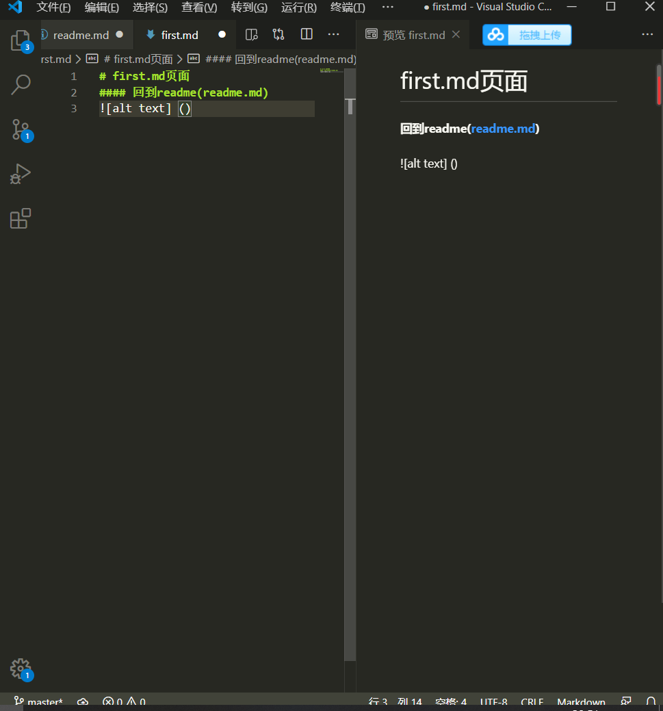

# first.md页面
#### 回到readme(readme.md)
图片:



代码段:
```
#include <stdio.h>
int main(){
    printf("Hello, World! \n");
    return 0;
}
```
> This is a blockquote. 

无序列表
* red
* green
* blue

有序列表
1. yellow
2. pink
3. orange


表格
| Tables        | Are           | Cool  |
| ------------- |:-------------:| -----:|
| col 3 is      | right-aligned | $1600 |
| col 2 is      | centered      |   $12 |
| zebra stripes | are neat      |    $1 |

粗体字
**this text**

斜体字
*this text*
或者是
_text_

删除文本
~~text line~~


